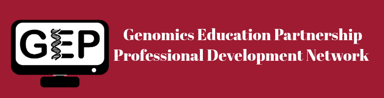

  
<body> 

We are excited to invite you to post your professional development opportunities on the Genomics Education Partnership Professional Development Network (GEPDeN) platform. This initiative aims to connect students and faculty with innovative genomics opportunities. Join us in fostering a vibrant community dedicated to scientific excellence and educational growth. Share your research and/or teaching positions today and help shape the future of genomics education! Get started by filling out the submission form.

</body>

<table align="center">
  <tr>
    <th>Posting Title</th>
    <th>Category</th>
    <th>Date Posted</th>
    <th>Closing Date</th>
  </tr>
  <tr>
    <td><a href="https://cresylviolet.github.io/pages/alleninstitute.html">Teaching Faculty Needed</a></td>
    <td>Faculty Positions</td>
    <td>June 27, 2024</td>
    <td>August 1, 2024</td>
  </tr>
</table>

